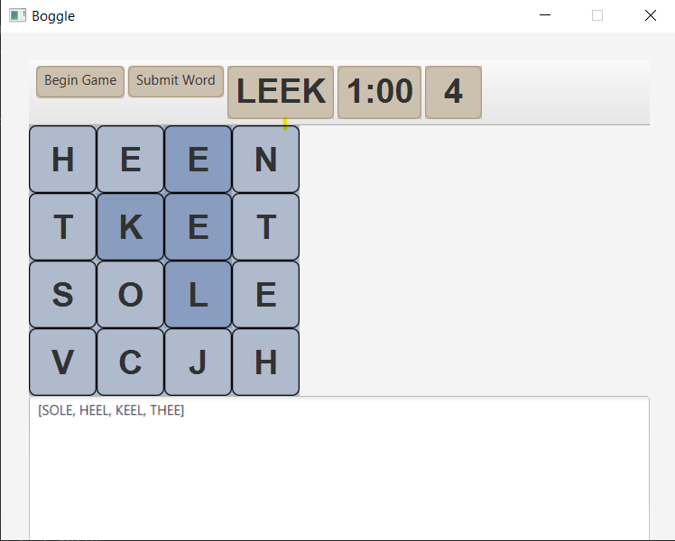

# Boggle
- Cube configuration is taken from [here](https://stanford.edu/class/archive/cs/cs106x/cs106x.1132/handouts/17-Assignment-3-Boggle.pdf/)
- Resources on Tries:  [Tries and Boggle](https://www.geeksforgeeks.org/boggle-set-2-using-trie/?ref=lbp)  [Overview Video](https://www.youtube.com/watch?v=K5gYn7qL3lE) [Implementation Video](https://www.youtube.com/watch?v=giiaIofn31A)

Current UI (not yet complete)
  